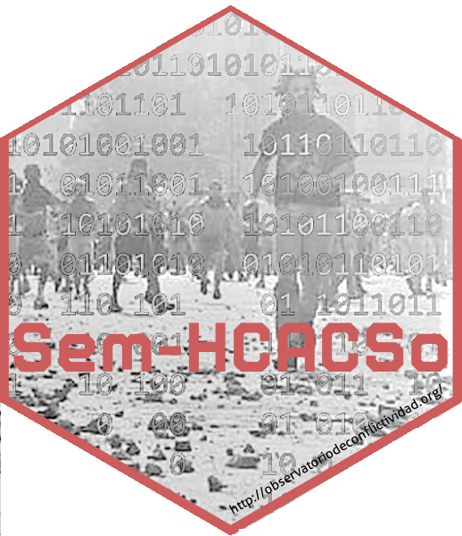

# Sem-HCACSo 
## Seminario de posgrado
### Herraminetas computacionales para el análisis de la conflictividad social

El giro digital y su boom de datos forzó diálogos insospechados entre las ciencias comunicacionales y las ciencias sociales y humanas. Las nuevas tecnologías y la proliferación de datos masivos en formato digital trajeron más desorden a los ya desordenados escritorios de científicxs sociales y humanistas (historiadorxs, sociólogxs, politólogxs, antropólogxs, filósofxs, etc., etc., etc.), que el contexto pandémico no hizo más que amplificar con su hipertrofiada virtualidad. ¿Cómo hacer archivo de forma remota? ¿Se puede hacer etnografía en la virtualidad? ¿Las encuestas online son confiables? ¿Son viables las entrevistas por telegram o whatsapp? ¿Cómo ir a la hemeroteca sin salir de casa? ¿Cómo leer cientos de periódicos sin hojearlos?
Las relaciones entre programación y ciencias sociales no son nuevas, pero sí más visibles y necesarias que hace unos años. No parece ser conveniente encerrarse en una postura contraria. Estamos cada vez más cerca de la incorporación de técnicas y métodos computacionales en los planes de estudios de las carreras universitarias de grado. Ciencias Sociales Computacionales, Humanidades Digitales, Historia Digital, lectura distante, métodos cualitativos digitales, son nombres cada vez más escuchados en nuestros ámbitos de trabajo. Y lo serán aún más en poco tiempo.
Dentro de la maraña de epistemologías, problemáticas, metodologías, técnicas, enfoques y lenguajes de programación disponibles para adentrarse en el mundo de las ciencias sociales computacionales y las humanidades digitales, elegimos el camino utilitarista de les autodidactas de tutoriales de youtube. A partir de un set pequeño de problemas concretos a resolver (cómo bajar de internet grandes cantidades de texto, de qué modo darle formato tabular, cómo limpiarlos, procesarlos, explorarlos y visualizarlos sin hacer una lectura cercana de lo recolectado, y no morir en el intento) nos relacionaremos con el lenguaje de programación R Project para desarrollar ejercicios de web scraping, minería de texto y lectura distante.
Este seminario se mete en todo esto con el horizonte de que quienes lo cursen puedan realizar análisis y mediciones de la conflictividad social, hechos de rebelión, eventos de protesta, o como quieran llamarlos. En este sentido, los lenguajes de programación como R, Python, Julia y otros nos brindan herramientas muy potentes tanto para desarrollar los tradicionales análisis estadísticos como para utilizar y desarrollar algoritmos útiles para procesar y analizar un gran volumen de información no estructurada como son las notas periodísticas publicadas diariamente por los portales noticiosos como La Nación, La Capital, Los Andes, El Día, Hoy, por nombrar solo algunos.
